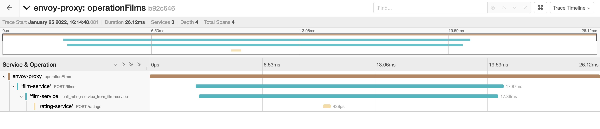
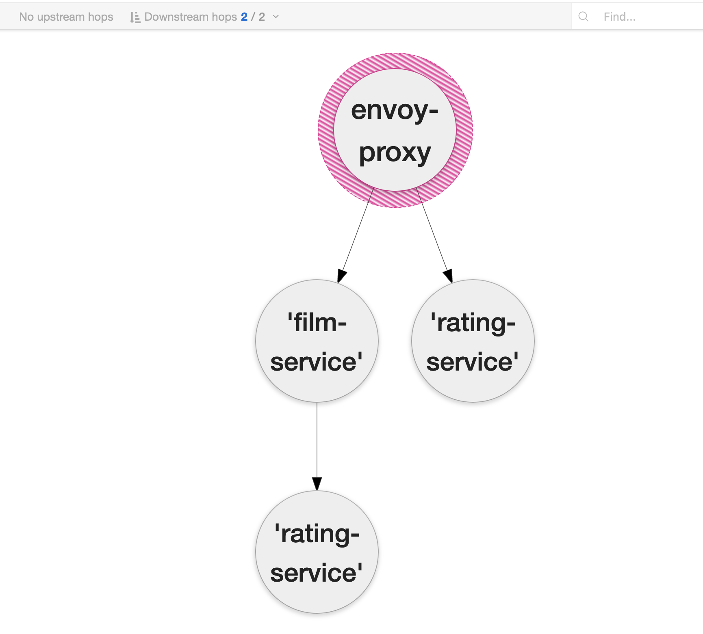

## Tracing Zipkin with Jaeger

Jaeger accepts traces generated by Opentelemetry as well as Zipkin. This example shows how Jaeger consumes Zipkin traces.
### Envoy Proxy
* A `frontend-proxy` services servers as the reverse proxy of this setup.
* The proxy is running using Envoy.
* `envoy-proxy.yaml` file has the configuration for Envoy.
* The `virtual_hosts` and `cluster` configuration for `frontend-proxy` is the same as `envoy-proxy` example.
* `generate_request_id` property of the `HttpConnectionManager` is set. The `HttpConnectionManager` will generate `x-request-id` header if it is not present.
* To perform tracing of request, we configure `Zipkin` tracers called `envoy.tracers.zipkin`.
* The tracer is configured using `ZipkinConfig`.
  * `collector_cluster`: The cluster manager cluster that hosts the Jaeger collectors.
  * `collector_endpoint`: The API endpoint of the Zipkin service where the spans will be sent.
  * `collector_endpoint_version`:
    * `HTTP_JSON`: Zipkin API v2, JSON over HTTP.
    * `HTTP_PROTO`: Zipkin API v2, protobuf over HTTP.
* Adding the `ZipkinConfig` configures Envoy to start creating request ID, trace ID etc.
  ```yaml
  generate_request_id: true
  tracing:
    provider:
      name: envoy.tracers.zipkin
      typed_config:
        "@type": type.googleapis.com/envoy.config.trace.v3.ZipkinConfig
        collector_cluster: jaeger-cluster
        collector_endpoint: "/api/v2/spans"
        collector_endpoint_version: HTTP_JSON
  ```
* The `response_headers_to_add` config adds the headers specified in the config to the response to the client. In this example, we add request ID and trace ID.
  ```bash
  $ curl -vsA "Testing" http://127.0.0.1:8080/ratings |  jq .
  *   Trying 127.0.0.1...
  * TCP_NODELAY set
  * Connected to 127.0.0.1 (127.0.0.1) port 8080 (#0)
  > GET /ratings HTTP/1.1
  > Host: 127.0.0.1:8080
  > User-Agent: Testing
  > Accept: */*
  >
  < HTTP/1.1 200 OK
  < content-type: text/html; charset=utf-8
  < content-length: 82
  < server: envoy
  < date: Mon, 24 Jan 2022 16:45:01 GMT
  < x-envoy-upstream-service-time: 21
  < x-b3-traceid: 3d7a3e4cb620f266
  < x-request-id: 732f2fd7-0290-9411-9a0d-0e08962f1839
  <
  { [82 bytes data]
  * Connection #0 to host 127.0.0.1 left intact
  * Closing connection 0
  [
      {
        "id": "b0994411-0747-4d51-b51f-8969e3079788",
        "name": "Titanic",
        "rating": "5"
      }
  ]
  ```

### Jaeger
* The Jaeger service is running in the kubernetes cluster.
* `jaeger` service is started with the config `COLLECTOR_ZIPKIN_HOST_PORT=9411` to allow jaeger to collect zipkin traces.
* `frontend-proxy`, `film-service` and `rating-service` are configured such that they forward `POST` their trace/span information to this `jaeger` service.
* The `ZipkinConfig` in Envoy config results in additional headers being added to the requests that reach the other services.
  ```bash
  $ curl -X POST http://127.0.0.1:8080/films --data "{       
    'name': 'Titanic',
    'language': 'English'
  }" | jq .
  [
      {
        "name": "Mad Max",
        "language": "English",
        "id": "b1757edc-454d-47b1-ab82-c18c06b6002b"
      },
      {
        "name": "Titanic",
        "language": "English",
        "id": "eeb67863-187b-4016-a190-db48ec568fa4"
      }
  ]
  ```
  ```bash
  ### Logs
  film-service_1    |  (service 'film-service'):(hostname af66a00ca7c9) Headers: {
      'X-Ot-Span-Context': None,
      'X-Request-Id': 'feb83141-204f-9efc-bc27-69e93514e883',
      'X-B3-TraceId': '534a99c76f8c9cc0',
      'X-B3-SpanId': '534a99c76f8c9cc0',
      'X-B3-ParentSpanId': None,
      'X-B3-Sampled': '1',
      'X-B3-Flags': None,
      'uber-trace-id': None,
      'sw8': None}
  ```
* A transport handler is created that provides a mechanism to propagate traces to zipkin service.
  ```python
  def default_handler(encoded_span):
      return requests.post(
          ZIPKIN_DSN,
          data=encoded_span,
          headers={"Content-Type": "application/json"})
  ```
* To create a new span, the `zipkin_span` function is used. _**Notice that the `ZipkinAttrs` for the span are configured using the trace/span IDs in the headers.**_
  ```python
  with zipkin_span(service_name=SERVICE_NAME,
        zipkin_attrs=ZipkinAttrs(
            trace_id=headers["X-B3-TraceId"], span_id=headers["X-B3-SpanId"],
            parent_span_id=headers["X-B3-ParentSpanId"],
            flags=headers['X-B3-Flags'],is_sampled=headers["X-B3-Sampled"],
        ),
        span_name="POST /films", transport_handler=default_handler):
  ```
  

  

### Services
* 2 services are deployed:
  * `film-service`:
    * holds the record of the id, name, and language of a film.
    * Port: `5000`
  * `rating-service`:
    * holds the record of the id, name, and rating of a film.
    * All ratings are 5 star right now.
    * Port: `6000`
* Both the services are created using flask.

### Deployment
#### Build Images
* Each service and envoy-proxy has a `Dockerfile`.
* The `Dockerfile` is used to create the image of the service.
#### Deploy on Kubernetes
* `kubernetes-deployment.yaml` file is used to deploy all the components.
* `film-service`, `rating-service` and `frontend-proxy` have corresponding `Deployment` and `Service`.
* Each service is discoverable using their `Service` names.
* `Service` map to `Deployment` using label selectors.
* Each pod has one container. The image for the container need to be build using the `Dockerfile`.
* Each container also needs to expose the ports that they want other pods/services to connect to.
  * For example `film-service` container needs to expose `5000` port so that other services can connect to this container's application.
  * **Note that this exposes the ports only inside the kubernetes network to other pods/services and NOT to the host network or internet!**
    ```bash
    $ kubectl apply -f kubernetes-deployment.yaml
    service/frontend-proxy created
    service/film-service created
    service/rating-service created
    service/jaeger created
    deployment.apps/frontend-proxy-deployment created
    deployment.apps/film-service-deployment created
    deployment.apps/rating-service-deployment created
    deployment.apps/jaeger-deployment created

    $ kubectl port-forward svc/frontend-proxy 8080:8080 --address 0.0.0.0
    Forwarding from 0.0.0.0:8080 -> 8080

    $ curl -X POST http://127.0.0.1:8080/films --data "{
      'name': 'Anand',
      'language': 'English'
    }"
    [{"name": "Anand", "language": "English", "id": "42aa33ed-4dbf-4694-a14d-a9d84eeb2cbd"}]

    $ curl -X GET http://127.0.0.1:8080/ratings | jq .
    [
      {
        "id": "42aa33ed-4dbf-4694-a14d-a9d84eeb2cbd",
        "name": "Anand",
        "rating": "5"
      }
    ]
    ```

### Test on Kubernetes
* Build the images.
* Deploys the services and the envoy proxy.
* Runs `curl` commands to check the APIs.
* Scales the services.
* Runs the `curl` commands to check the APIs again.
  * The scaled services don't share a common data fabric layer, they hold their data in memory.
  * `POST` could go to one replica and `GET` to another.
  * In the scaled setup, `POST` + `GET` verification can fail.
```
./k8s-verify.sh
```
