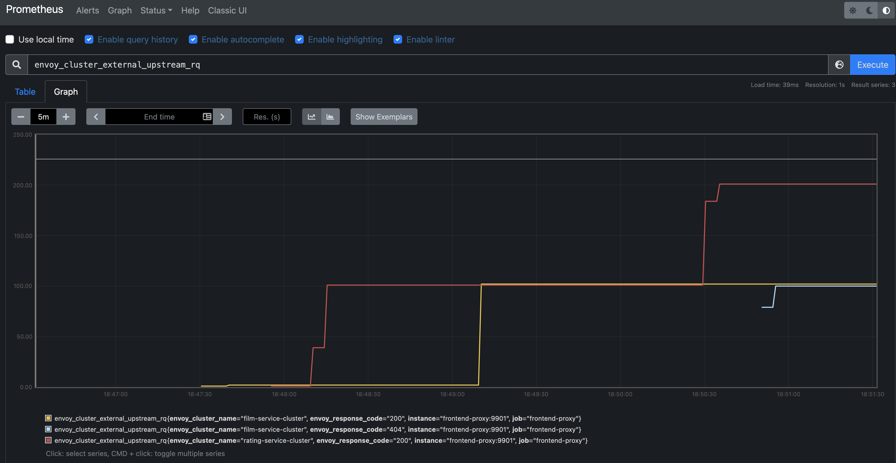

## Envoy Proxy

### Services
* 2 services are deployed:
  * `film-service`:
    * holds the record of the id, name, and language of a film.
    * Port: `5000`
  * `rating-service`:
    * holds the record of the id, name, and rating of a film.
    * All ratings are 5 star right now.
    * Port: `6000`
* Both the services are created using flask.

### Envoy Proxy
* A `frontend-proxy` services servers as the reverse proxy of this setup.
* The proxy is running using Envoy.
* `envoy-proxy.yaml` file has the configuration for Envoy.
* The main configuration are:
  * virtual host specification:
    * This configuration describes what route prefix matches with which cluster.
    * We configure that any `films/*` route is forwarded to `film-service-cluster` cluster.
    * We configure that any `ratings/*` route is forwarded to `rating-service-cluster` cluster.
    ```yaml
      virtual_hosts:
      - name: backend
        domains:
        - "*"
        routes:
        - match:
            prefix: "/films"
          route:
            cluster: film-service-cluster
        - match:
            prefix: "/ratings"
    ```
  * cluster specification:
    * This defines the cluster names, load-balancing policies and what services are part of this cluster.
    * In this example, both clusters have just on service load balancer endpoint.
    * Multiple services can be part of a cluster. Request to cluster will be load balanced on these services.
    ```yaml
      clusters:
      - name: film-service-cluster
        connect_timeout: 0.25s
        type: STRICT_DNS
        lb_policy: ROUND_ROBIN
        load_assignment:
          cluster_name: film-service-cl-name
          endpoints:
          - lb_endpoints:
            - endpoint:
                address:
                  socket_address:
                    address: film-service
                    port_value: 5000
      ```

### Metrics
* `Envoy` exports metrics on the admin port configured in `envoy-proxy.yaml`.
* The `/stats` endpoint exposes metrics for scraping by `statsd`.
* The `/stats/prometheus` endpoint exposes metrics that can be scraped by `prometheus`.
* `Prometheus` is configured using `prometheus.yaml` file.
* `Prometheus` scrapes `frontend-proxy` metrics.
* `http://localhost:9090` can be opened in browser to prometheus dashboards.


### Deployment
#### Build Images
* Each service and envoy-proxy has a `Dockerfile`.
* The `Dockerfile` is used to create the image of the service.
#### Deploy on Docker
* `docker-compose.yaml` file is used to compose all the services and add them to a common network `servicemesh`.
* Inside the `servicemesh` network, all services can discover each other using service names.
* Only the `frontend-proxy` exposes ports to the host system. All traffic to this network of microservices will pass through the `frontend-proxy`.
* The `film-service` and `rating-service` microservices don't expose any ports to the host. They expect no connections from the host directly.
#### Deploy on Kubernetes
* `kubernetes-deployment.yaml` file is used to deploy all the components.
* `film-service`, `rating-service`, `frontend-proxy` and `prometheus` have corresponding `Deployment` and `Service`.
* Each service is discoverable using their `Service` names.
* `Service` map to `Deployment` using label selectors.
* Each pod has one container. The image for the container need to be build using the `Dockerfile`.
* Each container also needs to expose the ports that they want other pods/services to connect to.
  * For example `film-service` container needs to expose `5000` port so that other services can connect to this container's application.
  * **Note that this exposes the ports only inside the kubernetes network to other pods/services and NOT to the host network or internet!**
* The `prometheus`config file `prometheus.yml` is created as a `ConfigMap`.
* The `ConfigMap` is created as a `volume` inside the pod `spec`.
* The `volume` is mounted inside the container using a `volumeMounts`. This way the `prometheus.yml` file is mapped from `configMap` to a file in the container.
```bash
  $ kubectl apply -f kubernetes-deployment.yaml
  service/frontend-proxy created
  service/film-service created
  service/rating-service created
  deployment.apps/frontend-proxy-deployment created
  deployment.apps/film-service-deployment created
  deployment.apps/rating-service-deployment created
  configmap/prometheus-server-conf created
  deployment.apps/prometheus-deployment created

  $ kubectl port-forward svc/frontend-proxy 8080:8080 --address 0.0.0.0
  Forwarding from 0.0.0.0:8080 -> 8080

  $ curl -X POST http://127.0.0.1:8080/films --data "{
    'name': 'Anand',
    'language': 'English'
  }"
  [{"name": "Anand", "language": "English", "id": "42aa33ed-4dbf-4694-a14d-a9d84eeb2cbd"}]

  $ curl -X GET http://127.0.0.1:8080/ratings | jq .
  [
    {
      "id": "42aa33ed-4dbf-4694-a14d-a9d84eeb2cbd",
      "name": "Anand",
      "rating": "5"
    }
  ]
```

### Test on Docker
* Build the images.
* Deploys the services and the envoy proxy.
* Runs `curl` commands to check the APIs.
* Scales the services.
* Runs the `curl` commands to check the APIs again.
  * The scaled services don't share a common data fabric layer, they hold their data in memory.
  * `POST` could go to one replica and `GET` to another.
  * In the scaled setup, `POST` + `GET` verification can fail.
```bash
./verify.sh
```

### Test on Kubernetes
```bash
./k8s-verify.sh
```
