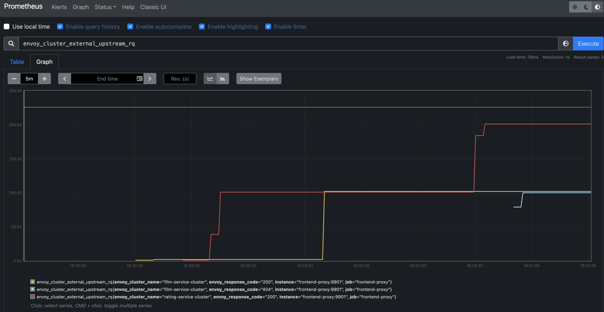

## Envoy Proxy

### Test
* Build the images.
* Deploys the services and the envoy proxy.
* Runs `curl` commands to check the APIs.
* Scales the services.
* Runs the `curl` commands to check the APIs again.
  * The scaled services don't share a common data fabric layer, they hold their data in memory.
  * `POST` could go to one replica and `GET` to another.
  * In the scaled setup, `POST` + `GET` verification can fail.
```bash
./verify.sh
```

### Services
* 2 services are deployed:
  * `film-service`:
    * holds the record of the id, name, and language of a film.
    * Port: `5000`
  * `rating-service`:
    * holds the record of the id, name, and rating of a film.
    * All ratings are 5 star right now.
    * Port: `6000`
* Both the services are created using flask.

### Envoy Proxy
* A `frontend-proxy` services servers as the reverse proxy of this setup.
* The proxy is running using Envoy.
* `envoy-proxy.yaml` file has the configuration for Envoy.
* The main configuration are:
  * virtual host specification:
    * This configuration describes what route prefix matches with which cluster.
    * We configure that any `films/*` route is forwarded to `film-service-cluster` cluster.
    * We configure that any `ratings/*` route is forwarded to `rating-service-cluster` cluster.
    ```yaml
    virtual_hosts:
    - name: backend
      domains:
      - "*"
      routes:
      - match:
          prefix: "/films"
        route:
          cluster: film-service-cluster
      - match:
          prefix: "/ratings"
    ```
  * cluster specification:
    * This defines the cluster names, load-balancing policies and what services are part of this cluster.
    * In this example, both clusters have just on service load balancer endpoint.
    * Multiple services can be part of a cluster. Request to cluster will be load balanced on these services.
    ```yaml
    clusters:
    - name: film-service-cluster
      connect_timeout: 0.25s
      type: STRICT_DNS
      lb_policy: ROUND_ROBIN
      load_assignment:
        cluster_name: film-service-cl-name
        endpoints:
        - lb_endpoints:
          - endpoint:
              address:
                socket_address:
                  address: film-service
                  port_value: 5000
    ```

### Metrics
* `Envoy` exports metrics on the admin port configured in `envoy-proxy.yaml`.
* The `/stats` endpoint exposes metrics for scraping by `statsd`.
* The `/stats/prometheus` endpoint exposes metrics that can be scraped by `prometheus`.
* `Prometheus` is configured using `prometheus.yaml` file.
* `Prometheus` scrapes `frontend-proxy` metrics.
* `http://localhost:9090` can be opened in browser to prometheus dashboards.



### Deployment
* Each service and envoy-proxy has a `Dockerfile`.
* The `Dockerfile` is used to create the image of the service.
* `docker-compose.yaml` file is used to compose all the services and add them to a common network `servicemesh`.
* Inside the `servicemesh` network, all services can discover each other using service names.
* Only the `frontend-proxy` exposes ports to the host system. All traffic to this network of microservices will pass through the `frontend-proxy`.
* The `film-service` and `rating-service` microservices don't expose any ports to the host. They expect no connections from the host directly.
